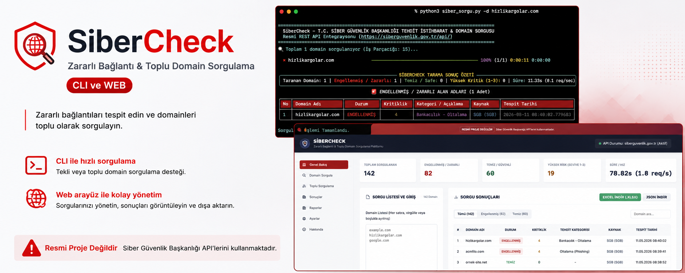
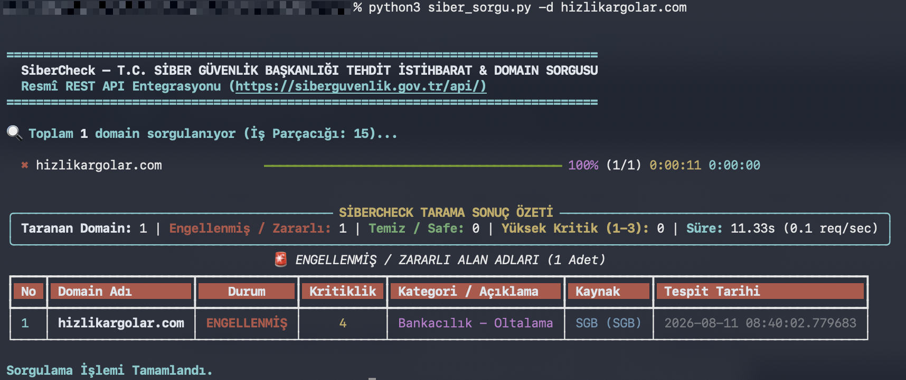
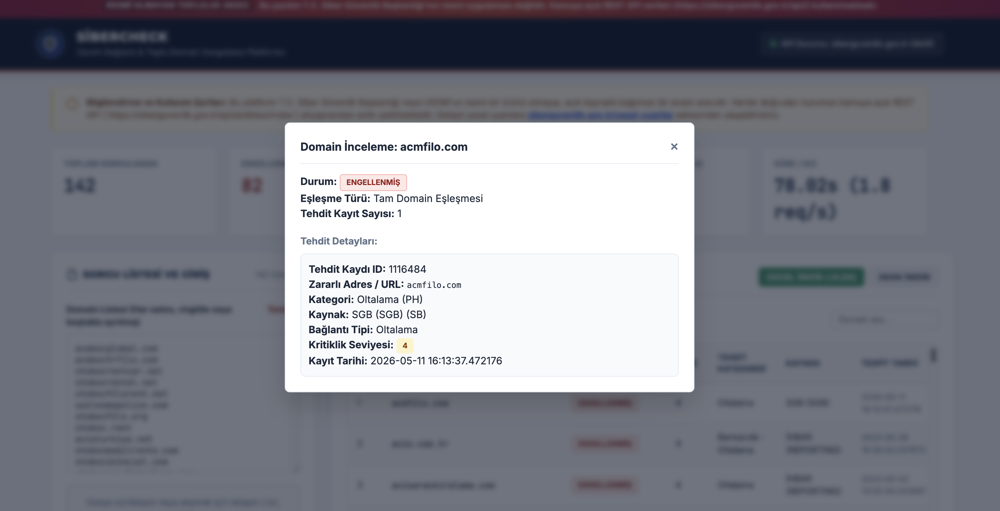

<p align="center">
  
</p>

# SiberCheck — Toplu Domain Engelleme & Tehdit İstihbaratı Sorgulama Aracı

[](https://www.python.org/)
[](LICENSE)
[](https://siberguvenlik.gov.tr/api/)

T.C. Siber Güvenlik Başkanlığı'nın sunduğu resmî tehdit istihbaratı REST API altyapısını (`https://siberguvenlik.gov.tr/api/`) kullanarak, elinizdeki domain listelerini toplu olarak sorgulayan, engellenmiş ve zararlı alan adlarını tespit eden açık kaynaklı bir araçtır.

Hem **CLI (Komut Satırı)** üzerinden hızlı tarama yapabilir hem de **Yerel Web Arayüzü (FastAPI Localhost Dashboard)** üzerinden görsel olarak sonuçları canlı akışla inceleyip **yönetici düzeyinde Excel (.xlsx)** ve **JSON** raporları alabilirsiniz.

---

## ⚠️ Yasal Uyarı ve Sorumluluk Reddi (Disclaimer)

1. **Resmî Uygulama Değildir**: Bu proje **T.C. Siber Güvenlik Başkanlığı** veya **USOM (Ulusal Siber Olaylara Müdahale Merkezi)** tarafından geliştirilmiş resmî bir yazılım veya ürün **DEĞİLDİR**. Bağımsız geliştiriciler tarafından, kurumun kamuya açık olarak sunduğu REST API entegrasyonu kullanılarak açık kaynaklı bir topluluk projesi olarak hazırlanmıştır.
2. **Veri Mülkiyeti**: Sorgularda kullanılan tüm tehdit verileri, zararlı bağlantı kayıtları, içerik kategorileri ve tescil tarihleri T.C. Siber Güvenlik Başkanlığı'na aittir.
3. **Kullanım Koşulları & İzinler**: Sunulan API'nin kullanımı ve veri erişim süreçleri hakkında detaylı bilgi için kurumun resmî [https://siberguvenlik.gov.tr/yasal-uyarilar](https://siberguvenlik.gov.tr/yasal-uyarilar) sayfasını inceleyiniz. Bu aracı kullanırken hedef sunucuları aşırı yüklememek (rate limit kurallarına uymak) kullanıcının sorumluluğundadır.
4. **Sorumluluk Reddi**: Bu aracın kullanımından doğabilecek doğrudan veya dolaylı herhangi bir aksaklık, hatalı tespit veya veri kaybından proje geliştiricileri sorumlu tutulamaz.

---

## Neden Bu Araç?

Eski `usom.gov.tr` üzerindeki `.txt` tabanlı zararlı liste paylaşımı sonlandırılmış olup, güncel verilere sadece **`siberguvenlik.gov.tr/api` REST altyapısı** üzerinden erişilmektedir.

Bu araç:
- Yüzlerce alan adını eşzamanlı (multi-threaded) olarak saniyeler içinde sorgular.
- URL'leri (`https://...`), port numaralarını ve pathteki fazlalıkları otomatik temizler.
- Türkçe karakterli alan adlarını Punycode (`IDN`) standardına çevirir.
- Canlı akış (real-time stream) ile her domain sorgulandıkça ekrana anında yansıtır.
- Yönetim seviyesine uygun grafikli ve renk rozetli **Excel (.xlsx)** çıktısı üretir.

---

## Kurulum

Gereksinimleri yüklemek için:

```bash
git clone https://github.com/gorkemguler/siber-check.git
cd siber-check
pip install -r requirements.txt
```

*(Eğer sisteminizde PEP 668 uyarısı alırsanız `--break-system-packages` parametresini ekleyebilir veya bir virtual environment (`python3 -m venv venv`) kullanabilirsiniz.)*

---

## 1. CLI (Komut Satırı) Kullanımı

CLI aracı `rich` kütüphanesi ile terminal üzerinde canlı ilerleme çubuğu ve renklendirilmiş durum tabloları sunar.

<p align="center">
  
</p>

### Hazır 100 Domainlik Demo Testi
Depo ile birlikte gelen 100 canlı test domaini üzerinde denemek için:
```bash
python3 siber_sorgu.py --demo -o rapor.xlsx -j rapor.json
```

### Kendi Listenizi Sorgulama (.txt / .csv)
```bash
python3 siber_sorgu.py -i domainler.txt -o sonuc_raporu.xlsx
```

### Tekil Domain Sorgusu
```bash
python3 siber_sorgu.py -d hizlikargolar.com
```

### Stdin / Pipe Desteği
```bash
cat domainler.txt | python3 siber_sorgu.py -o cikti.xlsx
```

### CLI Seçenekleri
```
-i, --input TEXT       Domain listesi içeren dosya yolu (.txt, .csv)
-o, --output TEXT      Excel rapor çıktısı alınacak dosya yolu (.xlsx)
-j, --json TEXT        JSON formatında veri çıktısı (.json)
-c, --csv TEXT         CSV formatında çıktı (.csv)
-t, --threads INT      Eşzamanlı sorgu thread sayısı (Varsayılan: 15)
-s, --strict           Tam (kesin) domain eşleşmesi zorunlu kıl
--demo                 100 adet örnek domain listesi ile test sorgusu çalıştır
--web                  Yerel Web Arayüzünü (FastAPI Dashboard) başlatır
```

---

## 2. Yerel Web Arayüzü (Localhost Dashboard)

Görsel olarak tarama yapmak, canlı arama ve filtreleme kullanmak için web arayüzünü başlatın:

```bash
python3 server.py
```
veya alternatif olarak:
```bash
python3 siber_sorgu.py --web
```

Tarayıcınızda **`http://127.0.0.1:8000`** adresini açın.

<p align="center">
  
</p>

### Dashboard Arayüz Özellikleri:
- **Canlı İstatistik Kartları**: Toplam Sorgulanan, Engellenmiş, Temiz ve Yüksek Riskli domain sayıları.
- **Toplu Giriş & Sürükle-Bırak**: Metin kutusuna alan adlarını yapıştırabilir veya `.txt`/`.csv` dosyanızı yükleyebilirsiniz.
- **Canlı Akış (Streaming)**: Sorgulanan domainler anında tabloya canlı olarak eklenir.
- **Filtreleme & Arama**: `Tümü`, `Engellenmiş`, `Temiz` sekmeleri ve anlık domain arama kutusu.
- **Tek Tıkla İndirme**: **"Excel İndir (.xlsx)"** ve **"JSON İndir"** butonları ile raporlarınızı anında bilgisayarınıza aktarabilirsiniz.
- **Detay Modalı**: Satırlara tıklayarak veritabanındaki kayıt ID'lerini, tehdit detaylarını ve tespit tarihlerini inceleyebilirsiniz.

---

## Excel Raporu Yapısı

Oluşturulan `.xlsx` raporları iki ayrı çalışma sayfasından oluşur:

1. **Özet Rapor (Executive Dashboard)**:
   - Kurumsal başlık banner'ı
   - Tarama metrikleri ve süresi
   - Engellenmiş / Temiz oranını gösteren pasta grafik (Pie Chart)
2. **Detaylı Liste (Data Sheet)**:
   - Koyu renk başlık tasarımı (`#1E293B`)
   - `ENGELLENMİŞ` durumunda kırmızı rozet dolgusu (`#FEE2E2` / `#991B1B`)
   - `TEMİZ` durumunda yeşil rozet dolgusu (`#D1FAE5` / `#065F46`)
   - Izgara çizgileri ve otomatik sütun genişlikleri

---

## Proje Yapısı

```
.
├── siber_sorgu.py              # CLI Giriş Noktası & Komut Satırı Aracı
├── server.py                   # FastAPI Yerel Web Sunucusu Başlatıcı
├── requirements.txt            # Python Bağımlılıkları
├── LICENSE                     # MIT Lisans Metni
├── README.md                   # Proje Dokümantasyonu
├── assets/
│   ├── sibercheck.png          # Proje Banner Görseli
│   ├── sibercheck2.png         # Web UI Ekran Görüntüsü
│   └── sibercheckcli.png       # CLI Terminal Ekran Görüntüsü
├── core/
│   ├── api_client.py           # siberguvenlik.gov.tr REST API İstemcisi
│   ├── normalizer.py           # Domain Temizleme & Punycode Dönüştürücü
│   └── domain_checker.py       # Multi-threaded Sorgu Motoru
├── exporters/
│   ├── excel_exporter.py       # OpenPyXL Excel Raporlayıcı
│   ├── json_exporter.py        # JSON ve CSV Dışa Aktarıcı
├── web/
│   ├── app.py                  # FastAPI Backend Servisleri
│   ├── static/                 # CSS & JavaScript Statik Dosyaları
│   └── templates/
│       └── index.html          # Web Dashboard HTML Şablonu
└── data/
    └── sample_100_domains.txt  # Demo Test Veri Seti (100 Domain)
```

---

## Lisans

Bu proje [MIT Lisansı](LICENSE) kapsamında lisanslanmıştır. Özgürce kullanılabilir, geliştirilebilir ve dağıtılabilir.
